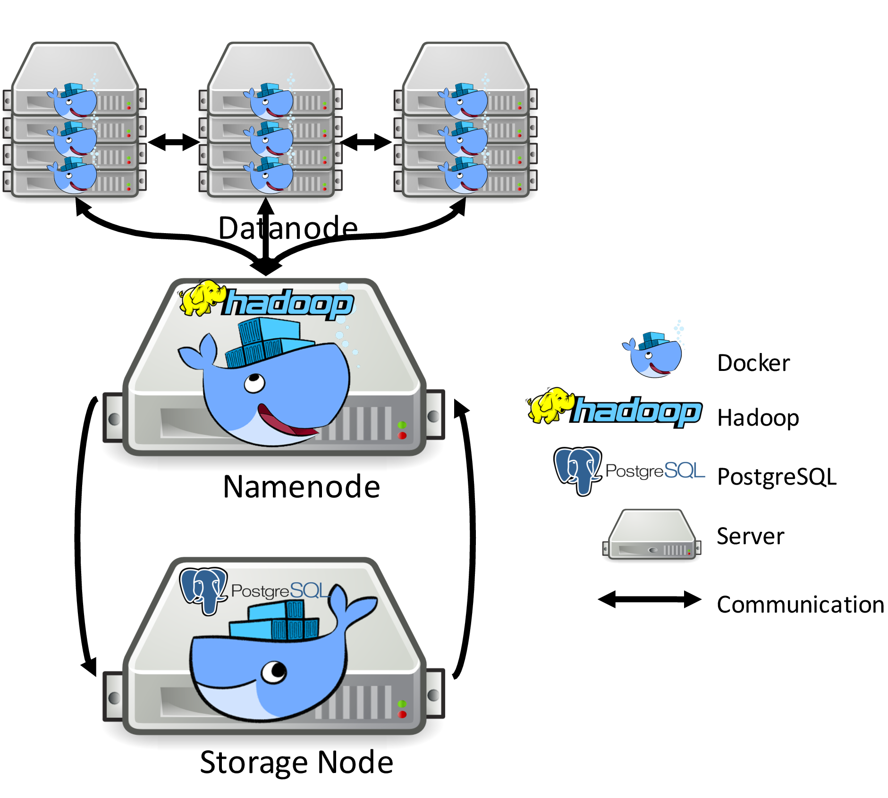

# Setting up Environment

In this section, you will learn how to setup the development environment. This project provides a flexible metadata storage layer to integrate different database systems into HDFS. For the sake of simplicity, only the Postgres integration is currently available.

The setup will be organized as follows:

0. Install Docker
1. Build a Postgres Docker Image
2. Build a Hadoop Development Environment Docker Image
3. Build Custom Source Code in Container
4. Start Hadoop HDFS in Container


## Install Docker

Due to the complexity of this project, Hadoop compilation involves a lot of dependencies. It is very hard to reproduce the experimental results on bare metal. The best way to solve this problem for anyone is to use the Docker.

[Docker](https://en.wikipedia.org/wiki/Docker_(software)) is a computer program that performs operating-system-level virtualization. Docker is used to run software packages called "containers". Containers are isolated from each other and bundle their own application, tools, libraries and configuration files; they can communicate with each other through well-defined channels. All containers are run by a single operating-system kernel and are thus more lightweight than virtual machines. Containers are created from "images" that specify their precise contents. Images are often created by combining and modifying standard images downloaded from public repositories.

You can download and install Docker from this webpage: [https://docs.docker.com/install/](https://docs.docker.com/install/). Docker
is available on multiple platforms. For example, Desktop (Mac and Windows), Server (CentOS, Debian, Fedora and Ubuntu).


After installation, you can issue the command to verify its version:

```bash
$ docker --version

Docker version 18.05.0-ce, build f150324
```

## Build a Postgres Docker Image

Postgres image is built by a [Dockerfile](https://github.com/DSL-UMD/hadoop-calvin/blob/calvin/Dockerfile):

```bash
$ cd $project_directory  # where Dockerfile is located
$ docker build -t eg_postgresql . # build a Docker image
```

Note: `postgresql-9.3` was packaged into Docker image, to change its version, please check out [Dockerfile#L20](https://github.com/DSL-UMD/hadoop-calvin/blob/calvin/Dockerfile#L20)!

`docker images` can list all images built locally or downloaded from registry:

```bash
$ docker images

REPOSITORY             TAG          IMAGE ID            CREATED             SIZE
eg_postgresql          latest       efb054f3e4d1        8 weeks ago         421MB
```

Now, you can start a Postgres container (in the background):

```bash
$ docker run -d -p 5432:5432 --name pg_test eg_postgresql
```

Note: docker run [OPTIONS] IMAGE [COMMAND] [ARG...]

- -d: Run container in background and print container ID
- --name: Assign a name to the container
- -p: Publish a container's port(s) to the host

**-p 5432:5432** means pg_test's port 5432 is mapped to the host network port 5432.
pg_test's network port 5432 (Postgres service) is not isolated from the Docker host.


`docker ps` can list all alive containers.

```bash
$ docker ps

CONTAINER ID    IMAGE            COMMAND                  CREATED        STATUS       PORTS                    NAMES
55eb5cf75643    eg_postgresql    "/usr/lib/postgresql…"   3 weeks ago    Up 9 hours   0.0.0.0:5432->5432/tcp   pg_test
```

## Build a Hadoop Development Environment Docker Image

### Hadoop Dev Docker Image

Fortunately, official Hadoop team already used Docker as their daily testbed.
We added a few software (**postgresql-client** and **jdbc**) in offical script to access **postgressql-9.3** in the former container (remote server): **pg_test**.




<span class="caption">Figure 1-1: The client server architecture diagram of HDFS and Postgres.</span>

These incremental commands are added in [start-build-env.sh#L67-L75](https://github.com/DSL-UMD/hadoop-calvin/blob/c337680e23ded375df17c09a878f719102a47773/start-build-env.sh#L67-L75).

Also, `docker run --net=host` was added [start-build-env.sh#L87](https://github.com/DSL-UMD/hadoop-calvin/blob/c337680e23ded375df17c09a878f719102a47773/start-build-env.sh#L87) in order to reach the comparable performance for container, which will perform identically to the bare metal.


Now, the following commands could be used to build and start Hadoop dev environment! The default container
name is **hadoop-dev**.

```bash
$ cd $project_directory  # where Dockerfile is located

# Build Hadoop Development Environment Docker Image and start it.
$ ./start-build-env.sh

$ docker ps

CONTAINER ID    IMAGE               COMMAND                  CREATED        STATUS       PORTS                    NAMES
a07214073fc3    hadoop-build-501    "/bin/bash"              9 hours ago    Up 9 hours                            hadoop-dev
55eb5cf75643    eg_postgresql       "/usr/lib/postgresql…"   3 weeks ago    Up 9 hours   0.0.0.0:5432->5432/tcp   pg_test
```

### Interact with Postgres

```bash
# Jump into hadoop-dev container
$ docker exec -it hadoop-dev bash

 _   _           _                    ______
| | | |         | |                   |  _  \
| |_| | __ _  __| | ___   ___  _ __   | | | |_____   __
|  _  |/ _` |/ _` |/ _ \ / _ \| '_ \  | | | / _ \ \ / /
| | | | (_| | (_| | (_) | (_) | |_) | | |/ /  __/\ V /
\_| |_/\__,_|\__,_|\___/ \___/| .__/  |___/ \___| \_(_)
                              | |
                              |_|

This is the standard Hadoop Developer build environment.
This has all the right tools installed required to build
Hadoop from source.

# Now, you are in hadoop-dev container!
# see prompt is changed from $ to xxx@linuxkit-025000000001 
xxx@linuxkit-025000000001:~/hadoop$
```

Since we installed **postgresql-client** and **jdbc driver** in hadoop-dev image, 
you can use them to access Postgres's service from remote server (**pg_test** container),
for example, connect to database server, create table and insert/select tuples:

```bash
xxx@linuxkit-025000000001:~/hadoop$ psql -h localhost -p 5432 -d docker -U docker

Password for user docker: # password is docker
SSL connection (protocol: TLSv1.2, cipher: DHE-RSA-AES256-GCM-SHA384, bits: 256, compression: off)

docker=# CREATE TABLE cities (name varchar(80), location point);

CREATE TABLE

docker=# INSERT INTO cities VALUES ('San Francisco', '(-194.0, 53.0)');

INSERT 0 1

docker=# SELECT * FROM cities;

     name      | location
---------------+-----------
 San Francisco | (-194,53)
(1 row)
```

### Build Custom Source Code in Container

Since the local directory is mounted to the internal directory of the container by default [start-build-env.sh#L88](https://github.com/DSL-UMD/hadoop-calvin/blob/c337680e23ded375df17c09a878f719102a47773/start-build-env.sh#L88). 

Note: docker run [OPTIONS] IMAGE [COMMAND] [ARG...]

-v, --volume list                    Bind mount a volume

In **hadoop-dev** container, you can `cd hadoop-hdfs-project` and build Hadoop souce code you mounted.


```bash
# Build Hadoop in hadoop-dev container
xxx@linuxkit-025000000001$ USER=$(ls /home/)
xxx@linuxkit-025000000001$ chown -R $USER /home/$USER/.m2
xxx@linuxkit-025000000001$ cd hadoop-hdfs-project

# Compile HDFS
xxx@linuxkit-025000000001$ mvn clean package -Pdist -Pnative -Dtar -DskipTests
```

### Start Hadoop HDFS in Container

After the compilation is complete, the next step is to consider how to deploy HDFS.
The deployment process is more complicated because it involves multiple components, such as multiple Datanodes, Namenode, and second Namenode. Here we start them through different processes on the same machine. How to deploy HDFS clusters will be introduced later.

1. add **linuxkit-025000000001** as an alias of localhost in `/etc/hosts`.

    ```bash
    # set password
    xxx@linuxkit-025000000001$ sudo passwd xxx  # user: xxx@linuxkit-025000000001
    xxx@linuxkit-025000000001$ sudo passwd root # user: root
    xxx@linuxkit-025000000001$ cat /etc/hostname

    linuxkit-025000000001

    xxx@linuxkit-025000000001$ cat /etc/hosts

    127.0.0.1       localhost
    ::1     localhost ip6-localhost ip6-loopback
    fe00::0 ip6-localnet
    ff00::0 ip6-mcastprefix
    ff02::1 ip6-allnodes
    ff02::2 ip6-allrouters

    xxx@linuxkit-025000000001$ sudo vim /etc/hosts
    # add linuxkit-025000000001 into 127.0.0.1       localhost
    # 127.0.0.1       localhost linuxkit-025000000001

    xxx@linuxkit-025000000001$ cat /etc/hosts

    127.0.0.1       localhost linuxkit-025000000001
    ::1     localhost ip6-localhost ip6-loopback
    fe00::0 ip6-localnet
    ff00::0 ip6-mcastprefix
    ff02::1 ip6-allnodes
    ff02::2 ip6-allrouters
    ```

2. create directories for various data generated by HDFS


    ```bash
    mkdir -p $HOME/hadoop/tmp
    mkdir -p $HOME/hadoop/name
    mkdir -p $HOME/hadoop/data
    ```

3. change both **core_site.xml** and **hdfs-site.xml** under `hadoop-dist/target/hadoop-3.3.0-SNAPSHOT/etc/hadoop/`

**core_site.xml**:

```xml
<?xml version="1.0" encoding="UTF-8"?>
<?xml-stylesheet type="text/xsl" href="configuration.xsl"?>
<configuration>
    <property>
        <name>fs.defaultFS</name>
        <value>hdfs://192.168.65.3:9000</value>
    </property>

    <property>
        <name>hadoop.tmp.dir</name>
        <value>/home/gangl/hadoop/tmp</value>
    </property>
</configuration>
```

**hdfs-site.xml**:

```xml
<?xml version="1.0" encoding="UTF-8"?>
<?xml-stylesheet type="text/xsl" href="configuration.xsl"?>
<configuration>
    <property>
        <name>dfs.replication</name>
        <value>1</value>
    </property>

    <property>
        <name>dfs.namenode.name.dir</name>
        <value>/home/gangl/hadoop/name</value>
    </property>

    <property>
        <name>dfs.datanode.data.dir</name>
        <value>/home/gangl/hadoop/data</value>
    </property>
    <property>
      <name>dfs.namenode.fs-limits.min-block-size</name>
      <value>10</value>
    </property>
    <property>
        <name>dfs.webhdfs.enabled</name>
        <value>true</value>
        <description>提供web访问hdfs的权限</description>
    </property>
</configuration>
```